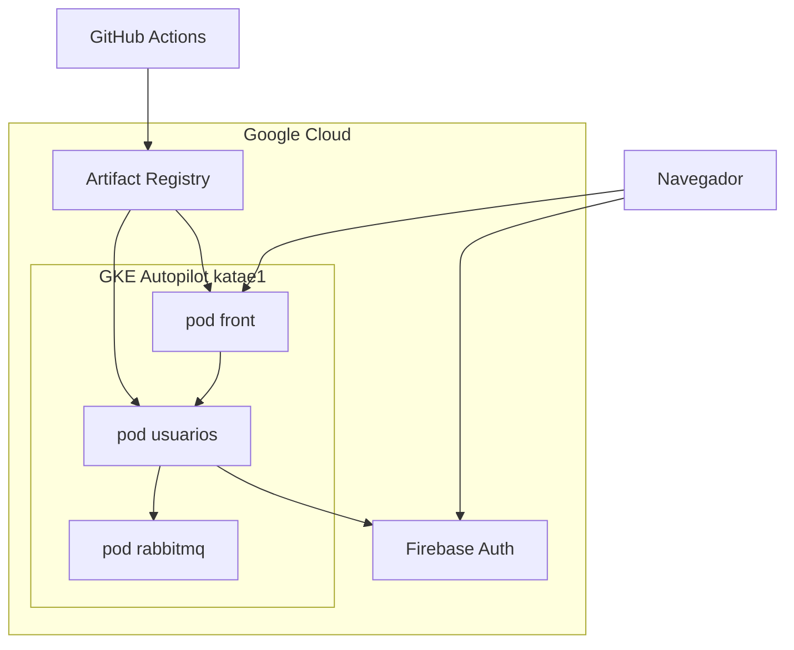

# Cómo funciona la infraestructura Kata E1

Guía para entender el runtime en Google Cloud (proyecto `round-seeker-309101`).

**Diagrama visual:** abre [diagrama-despliegue.html](diagrama-despliegue.html) en el navegador (mismo contenido que el canvas). En GitHub: [ver HTML](https://github.com/pipeelyo/KataE1infra/blob/main/diagrama-despliegue.html).



## Idea en una frase

El usuario abre una URL HTTP. Kubernetes sirve el React. El login lo hace Firebase. Nest solo comprueba el token. RabbitMQ está listo para colas, todavía sin productores.

## Qué hace cada pieza

**GKE Autopilot (`katae1`, región `us-central1`)**  
Google administra los nodos. Tú declaras pods; Autopilot pone máquinas. Namespace `katae1`.

**Pod front (2 réplicas)**  
Imagen nginx + React. El Service `front` es LoadBalancer: Google le pone IP pública (`35.254.92.206`). nginx sirve el HTML/JS y, si la ruta empieza por `/api/`, no busca un archivo: reenvía a Nest (`usuarios:3000`). Por eso el navegador habla con un solo origen.

**Pod usuarios (2 réplicas)**  
NestJS. `/api/health` dice si el proceso vive. `/api/auth/me` exige `Authorization: Bearer` y valida el JWT contra las llaves públicas de Firebase. `/api/resilience` hace ping TCP a RabbitMQ con circuit breaker.

**Pod rabbitmq (1 réplica)**  
Broker AMQP en la red del cluster. Service ClusterIP: solo lo ven otros pods. No tiene IP en internet. Sin disco: si el pod muere, se olvidan las colas.

**Firebase Auth (Identity Platform)**  
El navegador entra con Google, correo o SMS. Firebase emite el JWT. Nest no guarda usuarios; solo verifica la firma.

**Artifact Registry**  
Sitio de las imágenes Docker (`front` y `usuarios`). El cluster las baja de ahí, no de Docker Hub (salvo RabbitMQ).

**GitHub Actions**  
Tres repos. Front y usuarios: al push a `main` construyen imagen, la suben y cambian el Deployment. Infra: aplica `k8s/gke.yaml`. GitHub se autentica en GCP con Workload Identity Federation (sin JSON key).

**kind**  
Misma receta en tu Mac (`kind.yaml` + `k8s/katae1.yaml`). Hoy no está encendido. No es producción.

## Recorrido de un login

1. Entras a `http://35.254.92.206` o `http://35.254.92.206.sslip.io`.
2. El LoadBalancer entrega el pod front. React carga.
3. Pulas Google / correo / teléfono. El popup o el SMS lo resuelve **Firebase** (HTTPS). GKE no envía el SMS.
4. React toma el ID token y llama `/api/auth/me`. nginx lo manda a Nest.
5. Nest baja (o usa cache de) JWKS en `securetoken.google.com`, verifica issuer y audience = `round-seeker-309101`, y devuelve email / nombre / teléfono.
6. RabbitMQ no entra en el login. Nest solo lo vigila por TCP para el circuit breaker.

## Los tres repos

| Repo | Lo que cambia | Efecto |
| --- | --- | --- |
| [KataE1front](https://github.com/pipeelyo/KataE1front) | UI, nginx | Nueva imagen `front` y rollout |
| [KataE1Usuarios](https://github.com/pipeelyo/KataE1Usuarios) | API Nest | Nueva imagen `usuarios` y rollout |
| [KataE1infra](https://github.com/pipeelyo/KataE1infra) | YAML del cluster | Réplicas, probes, env, servicios |

Código de app ≠ forma del cluster. Si cambias un puerto o una réplica, es infra. Si cambias un botón, es front.

## Resiliencia

Kubernetes no envía tráfico a un pod hasta que pasa el **readiness**: front `/`, usuarios `/api/health`, RabbitMQ puerto `5672`.

Con 2 réplicas, borrar un pod de front o Nest no apaga la URL. Autopilot crea el reemplazo. nginx reintenta otra réplica si Nest no responde.

**Circuit breaker** (`GET /api/resilience`): 3 pings fallidos a RabbitMQ → estado `open` 10 s (no sigue golpeando el broker) → `half-open` prueba otra vez. `/api/health` **no** mira RabbitMQ: el login sigue si el broker cae. Cada pod Nest tiene su propio contador en memoria.

Aún frágil: RabbitMQ en 1 réplica sin PVC; Nest no publica mensajes; HTTP sin TLS.

## Cómo validar

```bash
gcloud container clusters get-credentials katae1 --region=us-central1 --project=round-seeker-309101

curl -s http://35.254.92.206/api/health
curl -s http://35.254.92.206/api/resilience

kubectl -n katae1 delete pod -l app=front --wait=false
curl -s -o /dev/null -w "%{http_code}\n" http://35.254.92.206/

kubectl -n katae1 scale deploy/rabbitmq --replicas=0
curl -s http://35.254.92.206/api/resilience   # repetir hasta circuit-open
curl -s http://35.254.92.206/api/health       # sigue ok
kubectl -n katae1 scale deploy/rabbitmq --replicas=1
```
